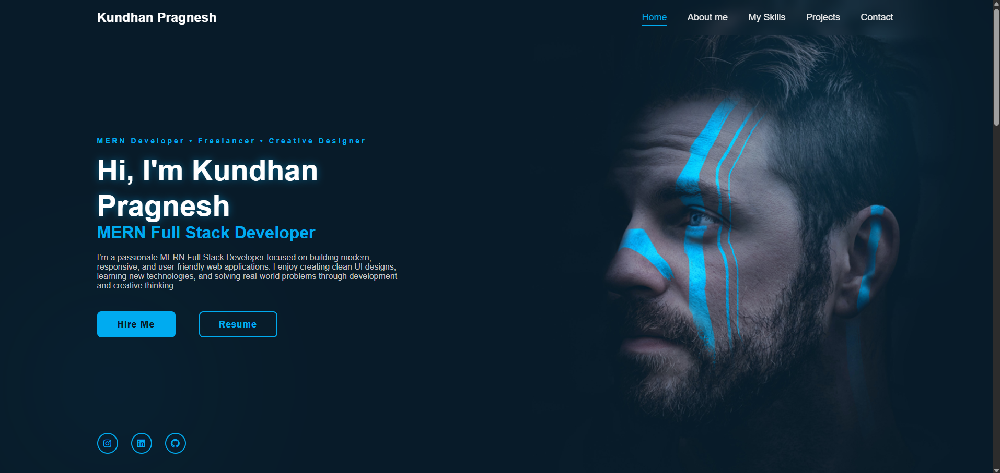
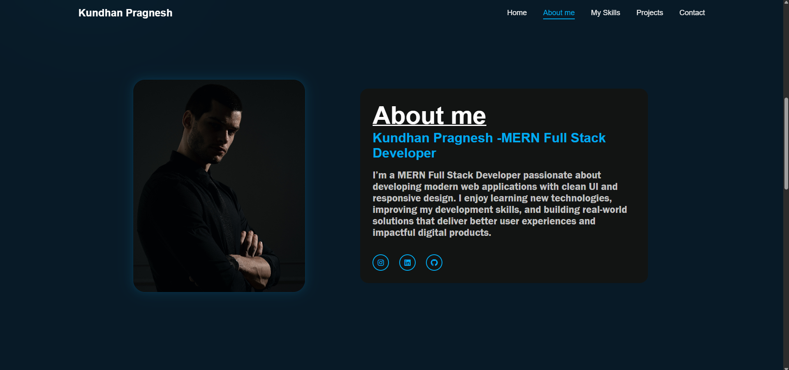
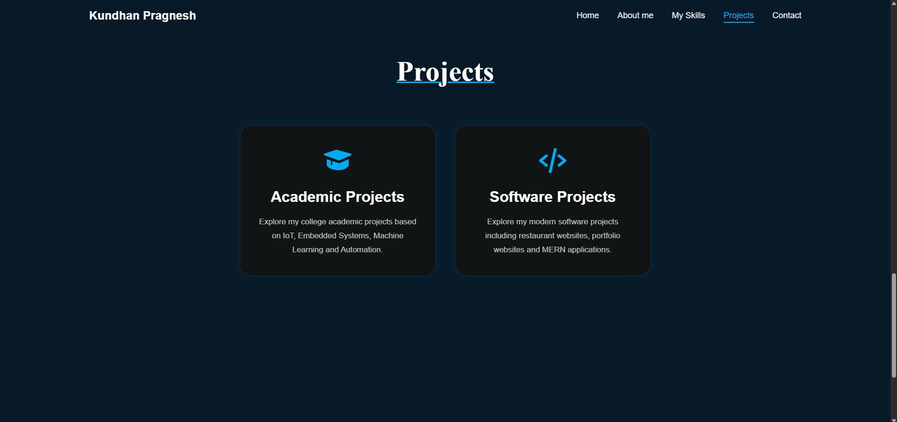

# Personal Portfolio Website

## Project Description

This project is a Personal Portfolio Website developed using HTML, CSS, and JavaScript. It showcases personal information, skills, projects, education, and contact details in a professional and responsive layout.

## Technologies Used

- HTML5
- CSS3
- JavaScript

## Features

- Responsive Design
- Professional Portfolio Layout
- About Me Section
- Skills Section
- Projects Showcase
- Contact Information
- Mobile-Friendly Interface

## Project Structure

```
Personal-Portfolio/
│
├── index.html
├── style.css
├── script.js
├── assets/
└── images/
```

## How to Run

1. Clone the repository
2. Open `index.html` in your browser
3. Explore the portfolio website

## Screenshots

### Home Page



### About Section



### Projects Section



## Learning Outcomes

- Responsive Web Design
- HTML Structure
- CSS Styling and Animations
- JavaScript DOM Manipulation
- Portfolio Development


## Internship Information

This project was completed as part of the CodeAlpha Frontend Development Internship Program.
